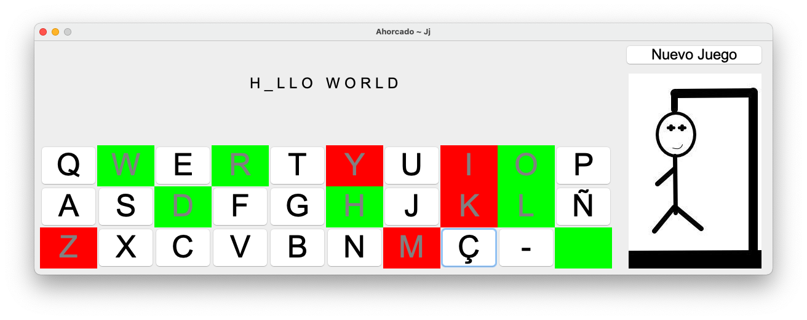

# Hangman


⚡ Hangman (ahorcado in Spanish) is a paper and pencil guessing game for two or more players. One player thinks of a word, phrase or sentence and the other(s) tries to guess it by suggesting letters within a certain number of guesses. 

You can download the Java jar from the [Releases](https://github.com/pablojj1808/Ahorcado/releases) section and run it.

``` sh
$> java -jar Ahorcado.jar
```
🚫 You may need to give it execute permissions.



## Class Diagram


## Tricky Steps
### Guessing words


### Playing (from the controller)


### End of the game

